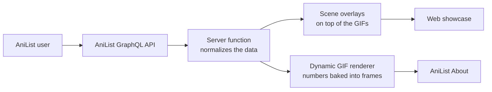

<div align="center">

# AniBio

### Cinematic AniList profiles

*A living profile for people who don't just watch stories — they get lost in them.*


</div>

---

## What is AniBio?

AniBio turns a real [AniList](https://anilist.co) account into a **cinematic, animated profile** instead of a plain wall of lists and statistics.

It pulls live data from the AniList GraphQL API (anime and manga counts, time watched, mean scores, and what you are watching or reading right now) and places it inside five hand-made animated scenes.

**MO20** is the flagship profile and the original implementation. AniBio is the project to turn that one-off into something anyone can reuse.

There are two parts:

| Part | What it does | Where it lives |
|---|---|---|
| **Web showcase** | A full-page cinematic site that renders the five scenes with live AniList data on top | This repository |
| **Dynamic GIF renderer** | An endpoint that bakes live numbers *into* the GIF frames so you can paste them into your AniList *About* | Deployed on Vercel (see [docs/RENDERER.md](docs/RENDERER.md)) |

---

## The five scenes

### 01 · Identity
Introduces the profile: name, what you read and watch, a personal line, and where you are from.


### 02 · Archive
Your accumulated history: anime and manga counts, time watched, chapters read and mean scores, pulled live from AniList.


### 03 · Current state
What you are consuming right now — **Now watching** and **Now reading** — so the profile feels alive.


### 04 · Reading mode
A short personal sequence: *find something interesting → one chapter → 87 chapters later → 4 AM.*


### 05 · Signature
The closing scene, with a "now playing" link.


---

## How it works



1. A TanStack Start **server function** (`src/lib/anilist.functions.ts`) queries `https://graphql.anilist.co` for `User.statistics` and the user's `CURRENT` anime and manga lists.
2. It converts the result to a small profile object: for example `daysWatched = minutesWatched / 1440`, and "completed" comes from the `COMPLETED` status count, not the total entry count.
3. The React page (`src/components/mo20-profile.tsx`) draws each scene as the original GIF with live data positioned on top.
4. Results are cached in memory for 5 minutes, and the request times out after 10 seconds.

> The numbers on screen come from AniList at request time. They are **not** hard-coded.

---

## Quick start

You need **Node.js 20+** (developed on Node 22).

```bash
git clone https://github.com/Nanicommet/AniBio.git
cd AniBio
npm install
npm run dev
```

Then open the URL that Vite prints.

Other scripts:

```bash
npm run build     # production build
npm run preview   # preview the production build
npm run lint      # ESLint + Prettier
npm test          # unit tests (Vitest)
```

---

## Use it on your AniList profile

AniList's *About* field is **Markdown**, so it can show images and GIFs but cannot run JavaScript.

**Option A — static scenes** (always works):

```markdown


```

**Option B — dynamic scenes** (live numbers drawn into the GIFs, MO20's deployment):

```markdown


```

The dynamic endpoint is *periodically refreshed* (cached for about an hour). It is not real-time push.

---

## Make it yours

The web showcase is currently wired to MO20. To use your own account, edit:

| What | Where |
|---|---|
| AniList user ID (`id: 6593775`) | `src/lib/anilist.functions.ts` |
| Name, `ANILIST // <id>` label, location | `src/components/mo20-profile.tsx` |
| Scene GIF URLs (`gifs` object) | `src/components/mo20-profile.tsx` |
| Overlay positions and sizes (percentages per scene) | `src/styles.css` |
| Palette and typography | `src/styles.css` (`--ember`, `--gold`, `--smoke`, Manrope + Space Mono) |

Your own backgrounds should be animated GIFs sized like the originals, so the overlay positions line up.

---

## Project structure

```text
AniBio/
├── src/
│   ├── components/
│   │   └── mo20-profile.tsx     # the five scenes and their live overlays
│   ├── lib/
│   │   ├── anilist.functions.ts # AniList GraphQL server function + data shaping
│   │   ├── error-capture.ts     # server error capture
│   │   ├── error-page.ts        # fallback error page
│   │   └── lovable-error-reporting.ts
│   ├── routes/
│   │   ├── __root.tsx           # document shell, fonts, error/404 pages
│   │   └── index.tsx            # the page, loading and error states
│   ├── test/                    # Vitest setup and component tests
│   ├── router.tsx  server.ts  start.ts  routeTree.gen.ts
│   └── styles.css               # design tokens and scene layout
├── docs/
│   ├── ARCHITECTURE.md          # data model, scene system, design rules
│   └── RENDERER.md              # how the dynamic GIF renderer works
├── public/robots.txt
└── package.json
```

---

## Limitations

- **The showcase is single-profile for now.** The AniList ID is fixed in code (see *Make it yours*). A username-based generator is on the roadmap.
- **AniList *About* cannot run code.** Anything interactive (such as a real audio player) would need a separate browser userscript or extension. The "now playing" card is a visual link to Spotify, not a player.
- **Dynamic GIFs are cached**, so numbers can be up to about an hour old.
- **The GIF renderer source is not in this repo yet** — see the roadmap.

---

## Roadmap

- [ ] Add the Vercel dynamic GIF renderer source to this repository
- [ ] Username-based profiles instead of a fixed ID
- [ ] A shared, normalized profile model that scenes consume
- [ ] Data-driven scene and template configuration (background, data bindings, positions, typography)
- [ ] More templates, palettes and fonts
- [ ] Genre fingerprint, favourites, streaks and milestones
- [ ] Optional userscript for audio and richer interaction on AniList

See [docs/ARCHITECTURE.md](docs/ARCHITECTURE.md) for the design behind these.

---

## Credits

- Data: the [AniList GraphQL API](https://docs.anilist.co/)
- Built with [TanStack Start](https://tanstack.com/start), React, Tailwind CSS and Lucide icons
- Initial app scaffolded with [Lovable](https://lovable.dev)
- Reference projects for AniList customization: [SaikoKurami](https://github.com/SaikoKurami/saikokurami.github.io), [void-verified](https://github.com/voidnyan/void-verified), [Automail](https://github.com/hohMiyazawa/Automail), [anilist-css](https://github.com/voidnyan/anilist-css)

AniBio is not affiliated with AniList.

## License

[MIT](LICENSE) © Nanicommet
